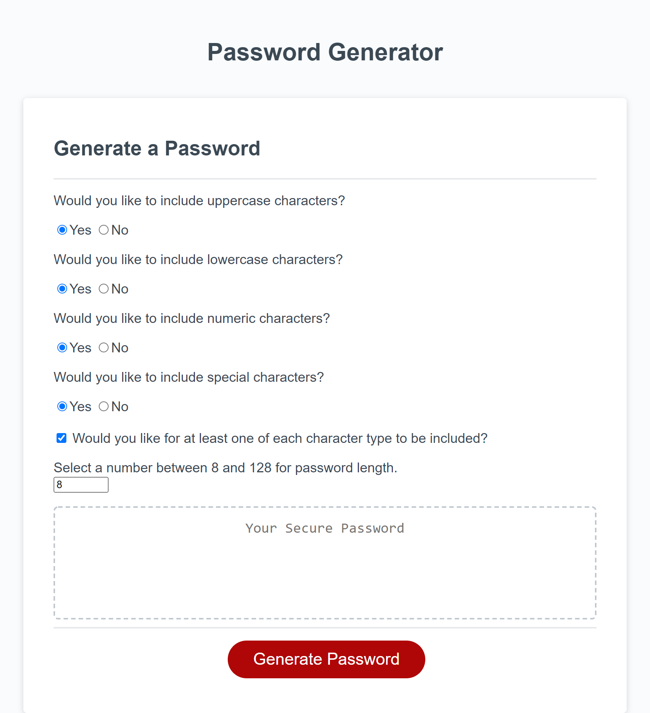

# password-generator
This password generator will generate passwords from 8 to 128 characters in length with character types of the user's choosing.  The user can select whether to include uppercase, lowercase, numeric and special characters.  The generator will randomly choose from among the included character types and will ensure that at least one of each selected type is included if the user so desires.

## Screenshot

## Deployment
[Password Generator deployment](https://justinnbyrd.github.io/password-generator/)

## Author
Justin Byrd [email](mailto:justin_byrd@hotmail.com)